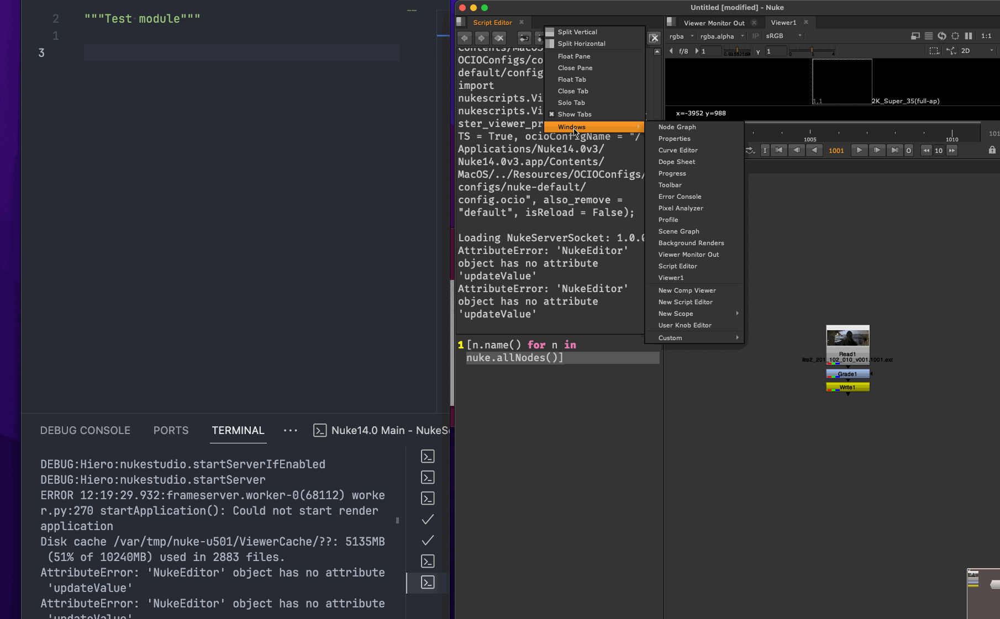

# 1. nukeserversocket README

[](https://github.com/sisoe24/nukeserversocket/releases)
[](https://github.com/sisoe24/nukeserversocket/releases)

[](https://github.com/sisoe24/nukeserversocket/blob/main/LICENSE)

[](https://github.com/sisoe24/nukeserversocket/issues)
[](https://github.com/sisoe24/nukeserversocket/pulls)
[](https://www.codacy.com/gh/sisoe24/nukeserversocket/dashboard?utm_source=github.com&amp;utm_medium=referral&amp;utm_content=sisoe24/nukeserversocket&amp;utm_campaign=Badge_Grade)
[](https://www.codacy.com/gh/sisoe24/nukeserversocket/dashboard?utm_source=github.com&utm_medium=referral&utm_content=sisoe24/nukeserversocket&utm_campaign=Badge_Coverage)


[](https://marketplace.visualstudio.com/items?itemName=virgilsisoe.nuke-tools)

- [1. nukeserversocket README](#1-nukeserversocket-readme)
  - [1.1. Client applications](#11-client-applications)
    - [1.1.1. Create a custom client](#111-create-a-custom-client)
  - [1.2. Installation](#12-installation)
    - [1.2.1. Nuke](#121-nuke)
      - [1.2.1.1. Using NukeTools (Recommended)](#1211-using-nuketools-recommended)
      - [1.2.1.2. Manual Installation](#1212-manual-installation)
    - [1.2.2. Houdini Installation](#122-houdini-installation)
      - [1.2.2.1. HOUDINI\_PACKAGE\_DIR](#1221-houdini_package_dir)
      - [1.2.2.2. Using Houdini Preferences](#1222-using-houdini-preferences)
    - [1.2.3. Houdini Notes](#123-houdini-notes)
  - [1.3. Usage](#13-usage)
  - [1.4. Settings](#14-settings)
  - [1.5. Known Issues](#15-known-issues)
  - [1.6. Compatibility](#16-compatibility)
  - [1.7. Python2.7](#17-python27)
  - [1.8. Contributing](#18-contributing)

>[!IMPORTANT]
> You can now execute code for Houdini! See installation notes

A PySide2 plugin for executing Python/BlinkScript remotely in Nuke from any network client, supporting multiple connections. Compatible with both Nuke and Houdini.

## 1.1. Client applications

Client applications that use nukeserversocket:

- [Nuke Tools](https://marketplace.visualstudio.com/items?itemName=virgilsisoe.nuke-tools) - Visual Studio Code extension.
- [nuketools.nvim](https://github.com/sisoe24/nuketools.nvim) - Neovim plugin.
- [Nuke Tools ST](https://packagecontrol.io/packages/NukeToolsST) - Sublime Text package.
- [DCC WebSocket](https://marketplace.visualstudio.com/items?itemName=virgilsisoe.dcc-websocket) - Visual Studio Code Web extension (deprecated at the moment).

### 1.1.1. Create a custom client

You can create a custom client in any programming language that supports socket communication. The client sends the code to the server, which then executes it in Nuke and sends back the result. For more information, see the [wiki page](https://github.com/sisoe24/nukeserversocket/wiki/Client-Applications-for-NukeServerSocket)

```py
# ... your socket code
data = {
    "text": "print([n.name() for n in nuke.allNodes()])",
    "file" : "path/to/file.py",
    "formatText": "0"
}
s.sendall(bytearray(json.dumps(data), 'utf-8'))
data = s.recv(1024)
s.close()

nodes = json.loads(data.decode('utf-8').replace("'", '"'))
for node in nodes:
    print(node)
```

## 1.2. Installation

### 1.2.1. Nuke

#### 1.2.1.1. Using NukeTools (Recommended)

If you use [Nuke Tools](https://marketplace.visualstudio.com/items?itemName=virgilsisoe.nuke-tools), simply run the command `Nuke: Add Packages` to install.

#### 1.2.1.2. Manual Installation

1. Download from [releases page](https://github.com/sisoe24/nukeserversocket/releases) or clone from GitHub
2. Place in *~/.nuke* or your preferred directory
3. Add to your *menu.py*:
```python
from nukeserversocket import nukeserversocket
nukeserversocket.install_nuke()
```

### 1.2.2. Houdini Installation

> **Note:** These instructions assume NukeServerSocket was installed via NukeTools in `$HOME/.nuke/NukeTools`. If installed manually, adjust paths accordingly. Also, you dont need to have Nuke installed to make this work.

#### 1.2.2.1. HOUDINI_PACKAGE_DIR

Add to your shell configuration:

**Mac/Linux** (.bashrc or .zshrc):
```bash
export HOUDINI_PACKAGE_DIR=$HOME/.nuke/NukeTools/nukeserversocket
```

**Windows:**
- Add `HOUDINI_PACKAGE_DIR` to Environment Variables (start menu)
- Set value to `%USERPROFILE%\.nuke\NukeTools\nukeserversocket`

>[!NOTE]
>For CMD/PowerShell users, refer to Microsoft's documentation on environment variables for alternative setup methods.

#### 1.2.2.2. Using Houdini Preferences

1. Navigate to your Houdini packages directory:
   - Windows: `C:/Users/YourName/Documents/houdiniXX.X/packages`
   - Mac: `~/Library/Preferences/houdini/XX.X/packages`
   - Linux: `~/houdiniXX.X/packages`

2. Create `nukeserversocket.json`:
```json
{
    "hpath": [
        "$HOME/.nuke/NukeTools/nukeserversocket/nukeserversocket/controllers/houdini"
    ],
    "env": [
        {
            "PYTHONPATH": "$HOME/.nuke/NukeTools/nukeserversocket"
        }
    ]
}
```

### 1.2.3. Houdini Notes

The Houdini execution method differs from Nuke's. Nuke relies on its internal script editor, while Houdini uses Python's `exec`. The Nuke controller also used to rely on `exec`, but I removed that functionality because it didn't work in all scenarios. If you have better suggestions, let me know!

## 1.3. Usage



1. Open the nukeserversocket panel inside Nuke, and start the server by clicking **Connect**.
2. You can now send code from Visual Studio Code with [Nuke Tools](https://marketplace.visualstudio.com/items?itemName=virgilsisoe.nuke-tools) or any other method you prefer.

>[!NOTE]
> If you receive a message: "_Server did not initiate. Error: The bound address is already in use_", change the **port** to a random number between `49152` and `65535` and try again.

## 1.4. Settings

>[!NOTE]
> Only the server timeout setting applies to Houdini.

You can access the settings from the plugin toolbar.

- **Mirror To Script Editor**: Allows mirroring the input/output code to the internal script editor.
- **Format Text**: The script editor output window will receive a formatted version of the code result. The available placeholders are:

  - `%d`: Time
  - `%t`: The code result
  - `%f`: The full file path
  - `%F`: The file name
  - `%n`: A new line

   **Format Text Example**: `%d - %t%n` will output `12:00:00 - Hello World!` in the script editor output window.

- **Clear Output**: The script editor output window will clear the code after each execution.
- **Server Timeout**: Set the Timeout when clicking the **Connect** button. The default value is `10` minutes.

## 1.5. Known Issues

- Changing workspace with an active open connection makes Nuke load a new plugin instance with the default UI state. So it would look as if the previous connection has been closed, whereas in reality is still open and listening. To force close all of the listening connections, you can:
  - Restart the Nuke instance.
  - Wait for the connection timeout.

## 1.6. Compatibility

Should work everywhere PySide2 and Python 3 work.

## 1.7. Python2.7

If you are using Python 2.7, you can still use the previous version of the plugin `<=0.6.2` from the [releases page](https://github.com/sisoe24/nukeserversocket/releases/tag/v0.6.2)

## 1.8. Contributing

If you have any suggestions, bug reports, or questions, feel free to open an issue or a pull request. I am always open to new ideas and improvements. Occasionally, I pick something from the [Projects](https://github.com/users/sisoe24/projects/4) tab, so feel free to check it out.
